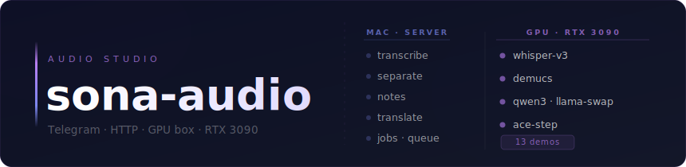

**Personal AI audio studio and model benchmark suite.**  
Transcription · Stem separation · Smart notes · Translation · Music generation.  
Heavy models run on a GPU box (RTX 3090); logic and the Telegram bot run on a Mac.

[](LICENSE)
[](https://github.com/dev-sergo/sona-audio/actions)
[](https://www.python.org/)
[](https://opensource.org/)

---

## What it does

| Feature | Model | Status |
|---|---|---|
| Speech transcription | faster-whisper large-v3 | ✅ ready |
| Stem separation | demucs htdemucs | ✅ ready |
| Smart notes | qwen3 via llama-swap | ✅ ready |
| RU → EN translation | Helsinki-NLP opus-mt (CPU) | ✅ ready |
| YouTube / SoundCloud download | yt-dlp | ✅ ready |
| Music generation | ACE-Step-1.5 | 🧪 samples ready · in-repo API WIP |
| TTS with your own voice | XTTS v2 | 📋 planned |

---

## 🎵 Demo — generated music

All tracks below were generated with **ACE-Step-1.5** on the RTX 3090 (~10 s each).
They are produced via the ACE-Step ComfyUI node today; wiring this into the in-repo
`/generate` endpoint is in progress (see [status](#status)). Click **download** to grab the `.mp3`.

| Genre | Waveform | Spectrogram | |
|---|---|---|---|
| **Drum & Bass** · 174 bpm |  | 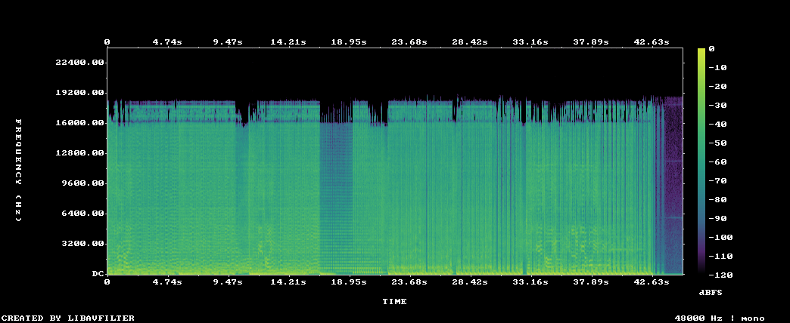 | [⬇ mp3](result-test/dnb.mp3) |
| **Deep House** · 124 bpm |  | 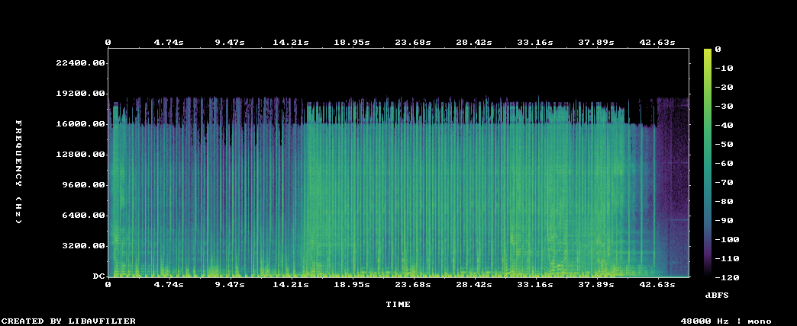 | [⬇ mp3](result-test/house.mp3) |
| **Alt Rock** · 140 bpm |  | 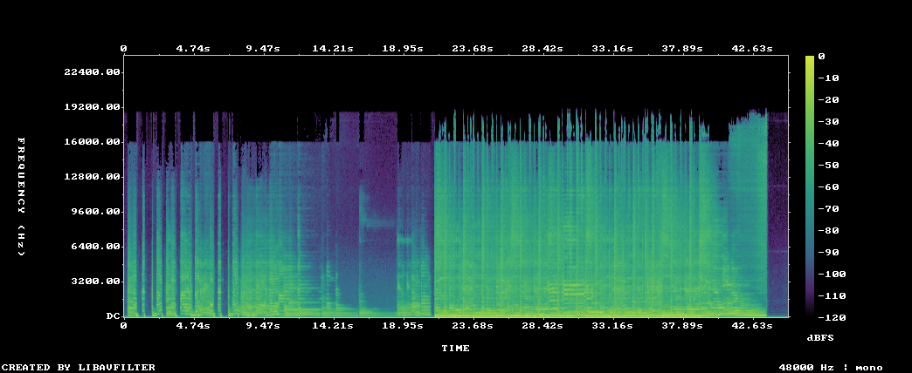 | [⬇ mp3](result-test/rock.mp3) |
| **Lo-fi Hip Hop** · 75 bpm |  | 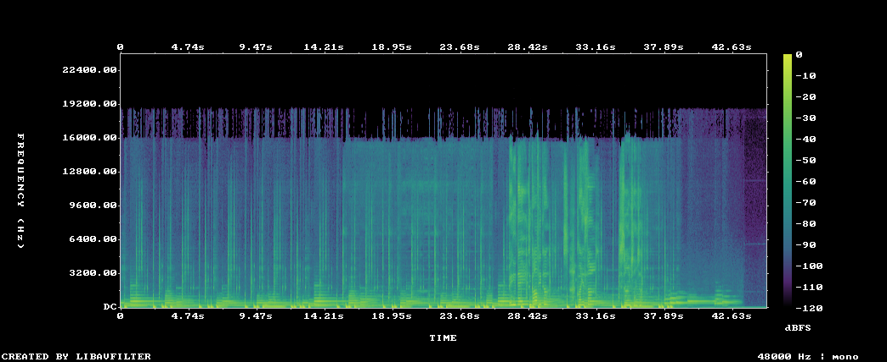 | [⬇ mp3](result-test/lofi.mp3) |
| **Boom Bap Rap** · 90 bpm |  | 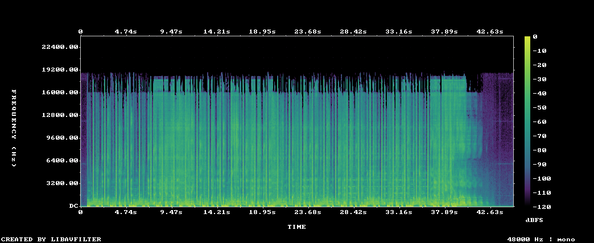 | [⬇ mp3](result-test/rap.mp3) |
| **Reggae** · 80 bpm |  | 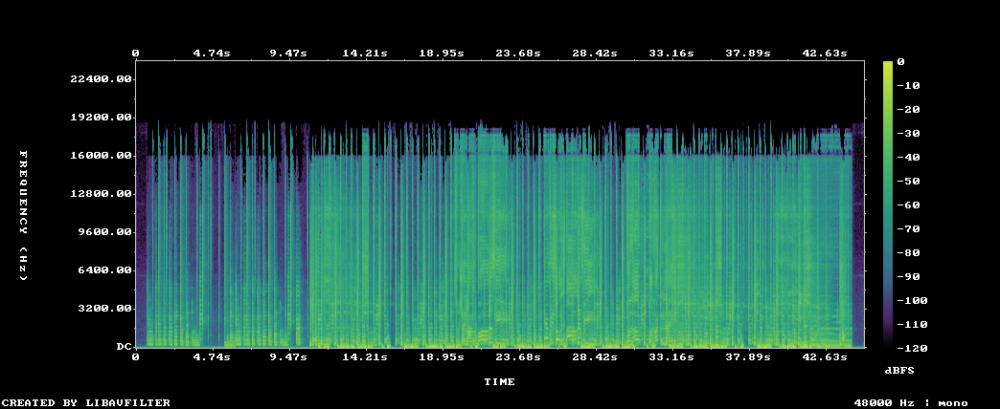 | [⬇ mp3](result-test/reggae.mp3) |
| **Heavy Metal** · 160 bpm |  | 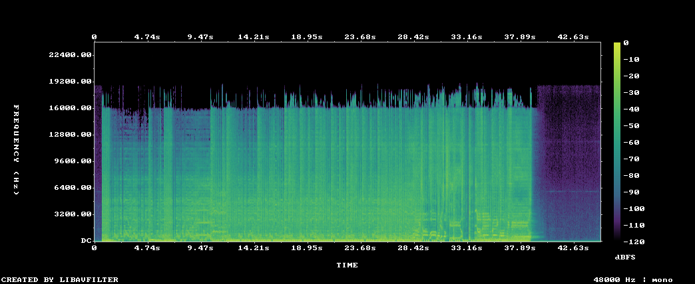 | [⬇ mp3](result-test/metal.mp3) |
| **Smooth Jazz** · 90 bpm |  | 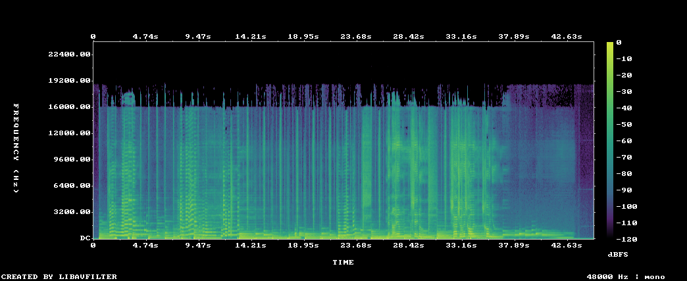 | [⬇ mp3](result-test/jazz.mp3) |
| **Country** · 110 bpm |  | 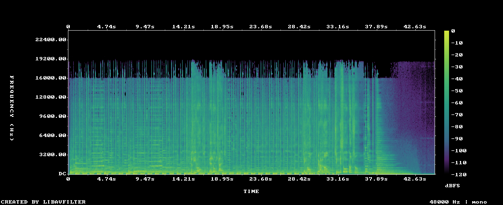 | [⬇ mp3](result-test/country.mp3) |
| **Funk** · 110 bpm |  | 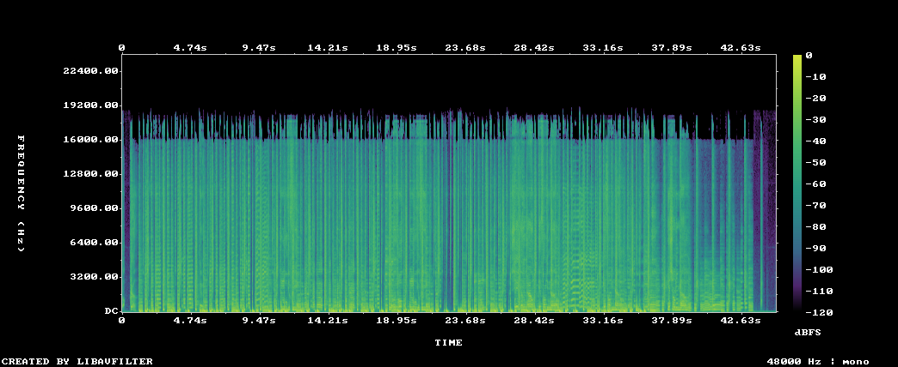 | [⬇ mp3](result-test/funk.mp3) |
| **Disco** · 120 bpm |  | 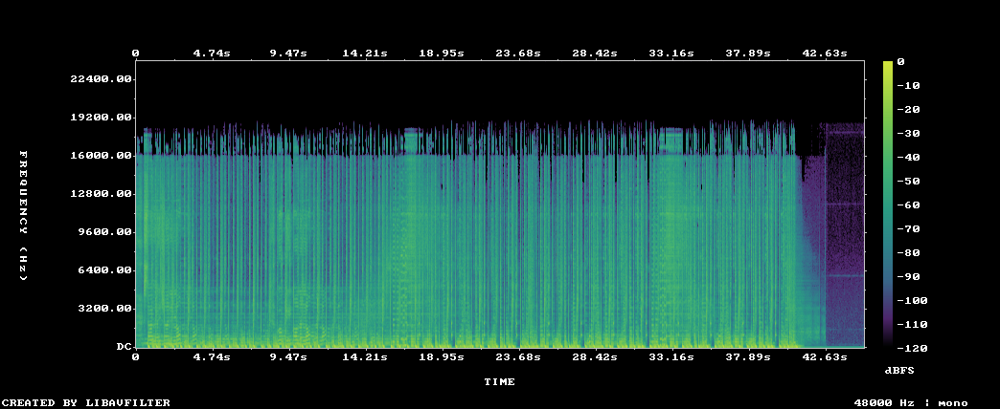 | [⬇ mp3](result-test/disco.mp3) |
| **Ambient** · 70 bpm |  | 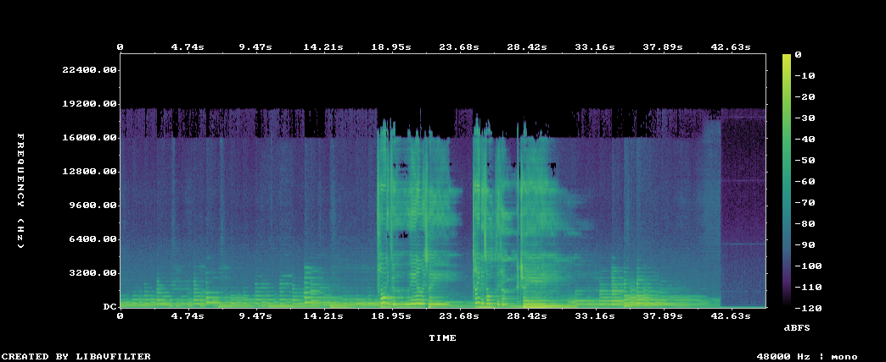 | [⬇ mp3](result-test/ambient.mp3) |
| **Blues** · 85 bpm |  | 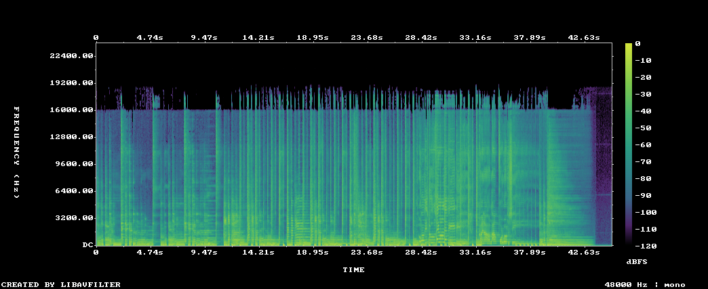 | [⬇ mp3](result-test/blues.mp3) |

> Waveform = amplitude over time; **spectrogram** = frequency content over time
> (log-frequency, dBFS, viridis). Spectrograms are generated from the `.mp3`s with
> [`scripts/make_spectrograms.sh`](scripts/make_spectrograms.sh) (ffmpeg).
>
> GitHub doesn't play inline audio for files committed to a repo — the links above
> download the `.mp3`. For inline players, attach files via the GitHub web UI.

---

## Status

What runs through the in-repo API/bot today, and what doesn't yet:

| Path | State |
|---|---|
| Transcription · stem separation · smart notes · translation | ✅ working end-to-end (HTTP + Telegram) |
| Music generation samples (above) | ✅ real ACE-Step output, generated via the ComfyUI node |
| Music generation through `/generate` → `model_server:/acestep` | 🚧 endpoint is a stub ([`model_server/main.py`](model_server/main.py)); ACE-Step Python API wrapper is the next task |
| TTS (XTTS v2) | 📋 planned |

This repo is honest about the seam: the **model** is proven (the demo tracks are its output), the **service integration** for generation is the remaining work.

---

## Architecture

```
Mac (Docker)                          GPU box (native, RTX 3090)
┌──────────────────┐                 ┌──────────────────────────┐
│  server  :8000   │ ─── HTTP ──▶   │  model_server  :8001     │
│  business logic  │                 │  Whisper · Demucs        │
│  SQLite · jobs   │ ─── HTTP ──▶   │  llama-swap    :8080     │
│  bot (Telegram)  │                 │  qwen3-32k               │
└──────────────────┘                 └──────────────────────────┘
```

- `model_server/` — inference only, needs CUDA
- `server/` — routes, job queue, SQLite, HTTP clients to the models
- `bot/` — Telegram UI (optional; everything is available over HTTP)

Full details: [docs/ARCHITECTURE.md](docs/ARCHITECTURE.md) · [docs/API.md](docs/API.md)

---

## Benchmarks (RTX 3090, 24 GB VRAM)

All numbers measured on the GPU box. Lower is better.

| Operation | Input | Time |
|---|---|---|
| Whisper large-v3 transcription | 60 s voice (OGG) | ~4 s |
| Demucs htdemucs stem split | 3 min track (MP3) | ~45 s |
| gemma-4-26b MoE translation | ~200 tokens | ~2 s |
| ACE-Step music generation* | 30–45 s track, turbo | ~10 s |

<sub>*measured via the ACE-Step ComfyUI node; the in-repo `/generate` endpoint that wraps it is still being wired up.</sub>

> Benchmark conditions, hardware and methodology: [docs/BENCHMARKS.md](docs/BENCHMARKS.md).
> These are indicative single-run figures, not rigorously averaged benchmarks (see the doc).

---

## Quick start

### GPU box (one-time setup)
```bash
git clone https://github.com/dev-sergo/sona-audio.git ~/sona-audio
cd ~/sona-audio
bash setup_gpu.sh          # creates venv, installs faster-whisper + demucs
make gpu-start             # starts model_server on :8001
```

### Mac
```bash
git clone https://github.com/dev-sergo/sona-audio.git
cd sona-audio
cp .env.example .env       # set MODEL_SERVER_URL and LLM_URL
make up                    # docker compose up -d  (server + bot)
make logs
```

Nothing is installed natively on the Mac — everything runs in Docker.  
To wipe it all: `make clean`.

---

## Testing

```bash
make test                  # automated tests in a python:3.11 container (no GPU needed)
```

Manual API checks without Telegram — see [docs/TESTING.md](docs/TESTING.md).

---

## How to add a new audio model

Repeatable recipe — example: adding a model called `foo`.

1. **GPU box** — `model_server/main.py`: loader `_load_foo()` + endpoint `POST /foo`
2. **Mac** — `server/services/foo_service.py`: HTTP client for `/foo`
3. **Mac** — route:
   - fast op → `server/routes/foo.py` + `include_router` in `server/main.py`
   - slow op → `register_handler("foo", ...)` in `server/main.py` (job queue)
4. **Deps** — `requirements.model_server.txt`
5. **Test** — `tests/test_foo.py` (mock the service, test the route)
6. _(optional)_ **Bot** — `bot/handlers/foo.py`

Existing models are untouched — each one is isolated.

---

## Makefile reference

| Command | Action |
|---|---|
| `make test` | run automated tests in Docker |
| `make build` / `make up` / `make down` | build images / start / stop |
| `make logs` | stream container logs |
| `make clean` | remove containers, images and `data/` |
| `make gpu-setup` / `make gpu-start` | install / run model_server (GPU box) |

---

## Contributing

Contributions, issues and pull requests are welcome.  
Please read [CONTRIBUTING.md](CONTRIBUTING.md) before opening a PR.

---

## License

MIT © 2026 [dev-sergo](https://github.com/dev-sergo)  
See [LICENSE](LICENSE) for the full text.
